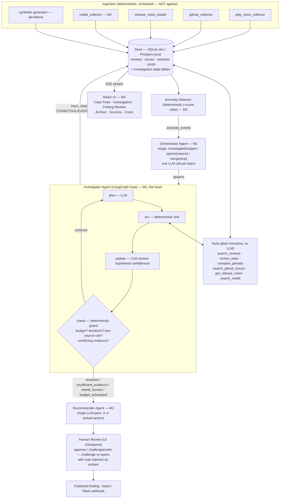

# EchoLens — System Architecture

**Product:** EchoLens ("Feedback Forensics") — an agentic product-feedback investigation system.
**Source docs:** [PRD.md](PRD.md) (system spec) · [echolens-ui-build/](echolens-ui-build/) (UI design handoff).

---

## 1. Governing rules

1. **Agents decide; tools execute; ingestion is dumb.** Anything whose steps can be drawn as a fixed flowchart at design time is a plain deterministic function, never an agent. Agents exist only where runtime judgment is required: what to investigate, which tool to call next, whether evidence suffices, when to escalate.
2. **No causal claim without an evidence chain.** Every finding cites specific reviews/issues/release notes by retrievable ID. Insufficient evidence is reported honestly — the agent never bluffs. Enforced by deterministic guards, not prompts.
3. **Cost-bounded agency.** Hard per-investigation budgets (iterations, tool calls, tokens, wall-clock, dollars) enforced in code. Budget exhaustion is a first-class, honestly-displayed outcome.

## 2. Component diagram



## 3. Repo layout

```
echolens/
├── ARCHITECTURE.md               ← this file
├── PRD.md
├── echolens-ui-build/            ← design handoff (reference only)
├── backend/
│   ├── pyproject.toml
│   ├── .env.example              # OPENAI_API_KEY, ECHOLENS_MODEL, ECHOLENS_DB_URL
│   ├── echolens/
│   │   ├── config.py             # pydantic-settings: budgets, tiers, model, pricing
│   │   ├── db/
│   │   │   ├── models.py         # full schema (§5)
│   │   │   └── session.py
│   │   ├── llm/
│   │   │   ├── client.py         # LLMClient protocol (swappable provider)
│   │   │   └── openai_client.py  # OpenAI impl, JSON-schema outputs, cost logging
│   │   ├── tools/                # 6 deterministic tools + registry (§6)
│   │   ├── investigator/
│   │   │   ├── state.py          # InvestigationState, Hypothesis, EvidenceItem, Budget
│   │   │   ├── graph.py          # LangGraph plan→act→update→check loop
│   │   │   ├── prompts.py
│   │   │   └── guards.py         # budget caps, two-source rule, claim-grounding scan
│   │   ├── synthetic/generate.py # "Lumo" demo dataset (seeded, deterministic)
│   │   ├── collectors/           # M2/M3 (stubs)
│   │   ├── detector/             # M2 (stub)
│   │   ├── orchestrator/         # M2 (stub)
│   │   ├── recommender/          # M2 (stub)
│   │   ├── api/                  # M2/M3 FastAPI (stub)
│   │   └── cli.py                # M1: python -m echolens.cli investigate --anomaly demo1
│   └── tests/
└── frontend/                     # React + Vite + TS (built in M3, pixel-matched to design)
```

## 4. The Investigator (M1 core)

A LangGraph state machine looping **plan → act → update → check**:

- **plan** (LLM, structured JSON): pick one tool + args + which hypothesis it tests, OR create/revise hypotheses, OR declare resolution / insufficient evidence / needs-human.
- **act** (deterministic): execute the tool, append `EvidenceItem`s. Tool failures become FAIL trace steps, marked blocking or non-blocking by the next plan step.
- **update** (LLM): revise hypothesis confidences; every change must cite the evidence ID that caused it.
- **check** (deterministic guard, no LLM):
  - budget remaining? iterations < cap? tokens < cap? wall-clock < cap?
  - any hypothesis ≥ 0.8 **and** two-source rule satisfied → `resolved`
  - strong conflicting evidence, or 0.5–0.8 confidence at budget end → `needs_human`
  - budget spent, best < 0.5 → `insufficient_evidence` (finding states what was checked and what would settle it)

**Hypothesis rules:** max 4 active; `supported` requires ≥ 2 independent evidence items from ≥ 2 distinct sources; otherwise it stays `active` and the finding escalates.

**Claim-grounding guard:** a deterministic post-check scans finding prose — causal sentences must reference evidence IDs; violations flag the finding rather than publish it.

**Trace:** every node appends a `trace_steps` row with `kind` ∈ THINK / TOOL / EVID / UPDT / FAIL — exactly the tags the Investigation screen renders. The M3 UI streams this table over SSE with no reshaping. The trace is persisted and replayable (demo resilience if the LLM rate-limits live).

## 5. Storage schema (SQLite dev → Supabase Postgres)

Corpus: `reviews (id, source, ext_id, rating, text, version, os_version, created_at, embedding NULL)` · `issues` · `posts` · `releases`.
Investigation state: `anomaly_events` · `investigations (+ paused, escalated, opened_by[anomaly|manual], budget_tier)` · `hypotheses` · `evidence` · `trace_steps` · `findings (status: draft|approved|challenged)` · `recommendations` · `review_feedback` · `llm_calls (tokens, cost, latency — feeds Costs screen + budget guard)`.

Search is keyword/LIKE with deterministic ranking in M1 (synthetic data is keyword-controllable); the nullable `embedding` column reserves the pgvector upgrade path for M2+.

## 6. Tools (deterministic contracts)

| Tool | Input | Output |
|---|---|---|
| `search_reviews` | query, date_range, rating_filter, limit | reviews with ids/dates/ratings/snippets |
| `review_stats` | term, granularity, segment (version/os) | daily counts, % of negatives, deltas |
| `compare_periods` | metric, before_range, after_range | means, delta %, z-score |
| `search_github_issues` | query, state, since | issues with ids/titles/snippets |
| `get_release_notes` | version or date_range | release entries |
| `search_reddit` | query, subreddit, since | posts with ids/snippets |

Token discipline lives here: outputs are truncated deterministically (top-k, char caps) before entering the LLM context.

## 7. LLM layer

- `LLMClient` protocol: `complete(messages, json_schema) -> parsed dict + usage`. Provider-agnostic.
- Default implementation: **OpenAI API** (`ECHOLENS_MODEL`, default `gpt-4o-mini`), JSON-schema structured outputs. Malformed output → one retry → FAIL trace step.
- Every call logged to `llm_calls` with token counts and computed cost. Groq/Gemini/Claude are drop-in swaps behind the protocol.

## 8. Budgets (enforced in `check`, config-driven)

| Tier | Iterations | Wall-clock | Notes |
|---|---|---|---|
| Quick look | 5 | 15 min | ~$0.25 cap |
| Standard (default) | 12 | 45 min | ~$0.75 cap |
| Deep dive | 30 | 2 h | ~$2.00 cap |

Plus per-case token cap (default 120k cumulative) and tool-call cap (20). Orchestrator-level daily caps (M2): max investigations/day, max daily $ spend. All adjustable from the Costs screen (M3).

## 9. API surface (M2/M3, FastAPI)

`POST /collect/run` · `POST /anomalies/scan` · `GET /anomalies` · `POST /investigations` (manual "New case": description, sources, budget tier) · `GET /investigations/{id}` · `GET /investigations/{id}/trace` (SSE) · `POST /investigations/{id}/pause|resume|escalate` · `POST /findings/{id}/review` (approve / challenge+note) · `GET /costs` · `GET /health`.

## 10. Frontend (M3 — done; React + Vite + TS)

Six screens pixel-matched to the design handoff, in `frontend/src/`: **Case Feed** (`screens/CaseFeed.tsx` — anomalies + triage chips + daily-budget meter), **Investigation** (`screens/Investigation.tsx` — live trace with THINK/TOOL/EVID/UPDT/FAIL/CHECK cards, hypothesis confidence bars, budget meters, follow-tail), **Finding Review** (`screens/FindingReview.tsx` — prose with clickable `[ev_x]` superscripts, evidence table, ranked actions, approve/challenge), **Archive**, **Sources**, **Costs**. Dark theme tokens in `theme.ts`/`tokens.css`, IBM Plex Sans/Mono, accent `#f0a63c`.

Data layer: `api.ts` (typed client), `hooks.ts` (`useAsync`, `useTrace`). Live trace updates via **SSE** from `GET /investigations/{id}/trace/stream` with automatic fallback to polling `GET /investigations/{id}/trace?after=seq`. Vite dev-proxies `/api/*` → backend (prefix stripped). Backend adds UI aggregates: `/feed/summary`, `/archive`, `/sources`, `/costs/summary`. `npm run build` type-checks clean; `python -m echolens.cli serve` + `npm run dev` runs the stack.

## 11. Milestones

- **M1 (done):** synthetic dataset + store + 6 tools + LangGraph investigator + CLI. Exit met: battery scenario resolves (H_sync supported, OS-update decoy rejected, all claims evidence-linked, within budget); insufficient-evidence scenario honestly fails.
- **M2 (done):** deterministic z-score detector (`detector/detect.py`), orchestrator triage with a code-enforced daily cap (`orchestrator/triage.py`), single-pass recommender (`recommender/recommend.py`), approve/challenge-reopens loop with note injection (`review.py`), FastAPI surface incl. SSE trace tail (`api/app.py`), and the eval harness (`eval/harness.py`): 6 golden scenarios (clear cause, decoy rejected, insufficient evidence, conflicting→needs_human, duplicate→merge, budget exhausted) with claim-grounding 100%, honesty 100%, budget compliance 100%. 38 tests green.
- **M3 (done):** React + Vite + TS UI — all six screens pixel-matched to the design, wired to the backend with a live SSE trace (poll fallback). New UI-facing endpoints (`/feed/summary`, `/archive`, `/sources`, `/costs/summary`). Verified end-to-end: `npm run build` type-checks clean (44 modules), the API serves real data through the Vite proxy, and a live investigation started via the API streams its trace over SSE to the Investigation screen. Remaining M3 stretch items (a real Play-Store collector swapped in beside synthetic, Render deploy, demo GIF) are optional polish.

### M2 evaluation metrics (from `python -m echolens.cli eval`)

| Metric | Result | Target |
|---|---|---|
| Golden-scenario pass rate | 100% (6/6) | — |
| Claim grounding (causal sentences cite real evidence) | 100% | 100% |
| Honesty (non-resolved never emits a supported finding) | 100% | 100% |
| Budget compliance (no run exceeds its caps) | 100% | 100% |
| Efficiency (median tool calls per resolved case) | 2 | tracked |
